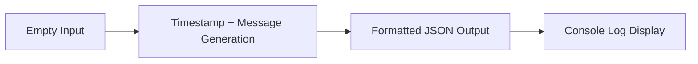

# 設計書: Simple Hello World

## 基本情報
- **文書ID**: DES-001
- **要件定義ID**: REQ-001
- **作成日**: 2025-07-21
- **作成者**: n8n Claude Code Development Kit
- **最終更新**: 2025-07-21

## 1. アーキテクチャ設計
### 1.1 全体構成
```
[Manual Trigger] → [Data Generator] → [Log Output] → [Complete]
      ↓                ↓                ↓
   手動実行        データ生成        ログ出力
```

### 1.2 ノード構成
| ノード名 | タイプ | 役割 | 設定概要 |
|---------|--------|------|----------|
| Manual Trigger | n8n-nodes-base.manualTrigger | 手動実行トリガー | デフォルト設定 |
| Data Generator | n8n-nodes-base.function | データ生成・変換 | JavaScript実行 |
| Log Output | n8n-nodes-base.function | ログ出力・表示 | console.log実行 |

## 2. データフロー設計
### 2.1 データ変換


### 2.2 データマッピング
| 入力フィールド | 出力フィールド | 変換ルール |
|---------------|---------------|------------|
| (none) | timestamp | new Date().toISOString() |
| (none) | japaneseTime | toLocaleString('ja-JP') |
| (none) | message | ランダム選択（4パターン） |
| (none) | executionCount | Math.random() * 100 + 1 |
| (none) | status | 固定値 "success" |

## 3. エラーハンドリング設計
### 3.1 エラーパターン
- **JavaScript Error**: 構文エラー、実行時エラー
- **Data Format Error**: JSON生成エラー
- **Console Error**: ログ出力エラー

### 3.2 エラー対応
- **基本方針**: シンプルな構成のためエラーハンドリングは最小限
- **対応方法**: n8nの標準エラー表示に依存

## 4. セキュリティ設計
### 4.1 認証設定
- **認証方式**: なし
- **アクセス制御**: n8nインスタンスへのアクセス権限に依存

### 4.2 データ保護
- **機密データ**: なし
- **ログマスキング**: 不要（機密情報取り扱いなし）

## 5. パフォーマンス設計
### 5.1 最適化方針
- **処理時間**: 最小限のJavaScript実行のみ
- **メモリ使用**: 軽量なデータ構造

### 5.2 制限事項
- **同時実行**: 手動実行のため制限なし
- **データ量**: 固定的な小サイズデータのみ

## 6. ノード実装詳細
### 6.1 Manual Trigger Node
```json
{
  "parameters": {},
  "name": "Manual Start",
  "type": "n8n-nodes-base.manualTrigger",
  "typeVersion": 1,
  "position": [100, 200]
}
```

### 6.2 Data Generator Node
```json
{
  "parameters": {
    "functionCode": "// 現在時刻と基本情報を生成\nconst now = new Date();\nconst timestamp = now.toISOString();\nconst japaneseTime = now.toLocaleString('ja-JP', {\n  timeZone: 'Asia/Tokyo'\n});\n\n// 実行回数をカウント（簡易版）\nconst executionCount = Math.floor(Math.random() * 100) + 1;\n\n// メッセージ生成\nconst messages = [\n  \"n8nワークフローが正常に実行されました！\",\n  \"Hello World from n8n!\",\n  \"Claude Codeとn8nの連携テスト成功\",\n  \"シンプルなワークフローの完成です\"\n];\n\nconst message = messages[Math.floor(Math.random() * messages.length)];\n\nreturn [{\n  json: {\n    timestamp: timestamp,\n    japaneseTime: japaneseTime,\n    message: message,\n    executionCount: executionCount,\n    status: \"success\",\n    workflow: \"Simple Hello World\",\n    version: \"1.0.0\"\n  }\n}];"
  },
  "name": "Generate Data",
  "type": "n8n-nodes-base.function",
  "typeVersion": 1,
  "position": [300, 200]
}
```

### 6.3 Log Output Node
```json
{
  "parameters": {
    "functionCode": "// 入力データを取得\nconst data = items[0].json;\n\n// ログメッセージをフォーマット\nconst logMessage = `\n=== n8n Simple Hello World ===\n実行時刻: ${data.japaneseTime}\nメッセージ: ${data.message}\n実行回数: #${data.executionCount}\nステータス: ${data.status}\nワークフロー: ${data.workflow}\n========================\n`;\n\n// コンソールに出力\nconsole.log(logMessage);\n\n// 結果を返す\nreturn [{\n  json: {\n    ...data,\n    logMessage: logMessage,\n    completed: true\n  }\n}];"
  },
  "name": "Output Log",
  "type": "n8n-nodes-base.function",
  "typeVersion": 1,
  "position": [500, 200]
}
```

## 7. テスト設計
### 7.1 テストシナリオ
- **正常系**: Manual Trigger → Data Generation → Log Output
- **データ検証**: 生成されるJSONの形式とフィールド
- **ログ確認**: コンソール出力の可読性

### 7.2 検証項目
- タイムスタンプの正確性
- ランダムメッセージの表示
- JSON構造の整合性
- ログフォーマットの適切性

## 8. 運用設計
### 8.1 実行方法
1. n8n GUIでワークフローを開く
2. "Execute Workflow"ボタンをクリック
3. 各ノードの実行結果を確認
4. ブラウザ開発者ツールでコンソールログを確認

### 8.2 トラブルシューティング
- **実行されない**: Manual Triggerの設定確認
- **データが生成されない**: Function Nodeのコード確認
- **ログが表示されない**: ブラウザ開発者ツールの確認